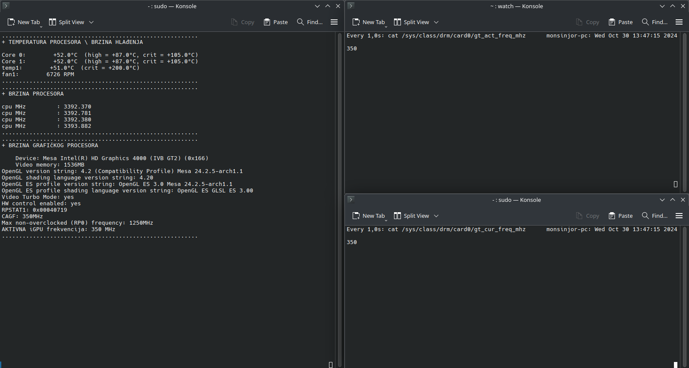

# BtPnttT
Bringing the P next to the T
## squeezing the most of dem juiceZZ from the thinkpad t430 series of notebooks, compiled, built against an arch-distro > endevaour os
### main contribution from the user #eigenbrot, who provided the patch that could be run against the, currently, tested kernel from the LTS branch, 4.19.322
### > i915.rc6_enabled=0, kernel flag, parameter and module option, tested and working
##
### will be adding more thorough approach for cpu and fan modulation
so, if you were to run:
> $ echo on | tee /sys/class/drm/card0/power/control /sys/devices/i915/power/control
> 
> $ echo 1250 | sudo tee /sys/class/drm/card0/gt_boost_freq_mhz /sys/class/drm/card0/gt_max_freq_mhz /sys/class/drm/card0/gt_min_freq_mhz
## 
you get a locked frequency of 1250 MHz for the iGPU on the i7 die:
## 
### zum Beispiel:

## 
or if you were to go powersaving, while being sure that you have the constant minimum of power draw, render wise scenarios:
> $ echo 350 | sudo tee /sys/class/drm/card0/gt_boost_freq_mhz /sys/class/drm/card0/gt_max_freq_mhz /sys/class/drm/card0/gt_min_freq_mhz
##
you get a locked frequency of 350 MHz for the iGPU:
##
### zum Beispiel Zwei:

