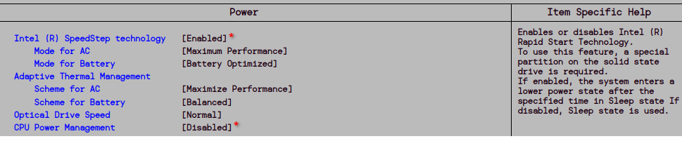

# BtPnttT
Bringing the P next to the T
## squeezing the most of dem juiceZZ from the thinkpad t430 series of notebooks, compiled, built against an arch-distro > endevaour os
### main contribution from the user #eigenbrot, who provided the patch that could be run against the, currently, tested kernel from the LTS branch, 4.19.322
### > i915.rc6_enabled=0, kernel flag, parameter and module option, tested and working
##
### will be adding more thorough approach for cpu and fan modulation
so, if you were to run:
> $ echo on | tee /sys/class/drm/card0/power/control /sys/devices/i915/power/control
> 
> $ echo 1250 | sudo tee /sys/class/drm/card0/gt_boost_freq_mhz /sys/class/drm/card0/gt_max_freq_mhz /sys/class/drm/card0/gt_min_freq_mhz
## 
you get a locked frequency of 1250 MHz for the iGPU on the i7 die:
## 
### zum Beispiel:
> chmod +x monitorScript.sh
>
> ./monitorScript.sh

## 
or if you were to go powersaving, while being sure that you have the constant minimum of power draw, render wise scenarios:
> $ echo 350 | sudo tee /sys/class/drm/card0/gt_boost_freq_mhz /sys/class/drm/card0/gt_max_freq_mhz /sys/class/drm/card0/gt_min_freq_mhz
##
you get a locked frequency of 350 MHz for the iGPU:
##
### zum Beispiel Zwei:

##
now, for the CPU part, many democrats state that you should manually set, or through custom governers, the frequency of CPU cores, while in fact, no one mentions the benefit of using the intel-p-state drivers for achieving the same thing on a constant level, so bear with me:

##
prerequisites and biscuits, BIOS setting, under POWER tab:
- enable P state
- disable power management

##
### zum Beispiel Drei:

change the governor to performance
> echo performance | tee /sys/devices/system/cpu/cpu*/cpufreq/scaling_governor

disable TURBO bit, to avoid dynamic change of frequencies across all cores, it only effects the 1 turbo thread
> echo 0 > /sys/devices/system/cpu/intel_pstate/no_turbo

add the 100 percent to the minimum and maximum margin, so the maximum frequency across all cores is set, and constant
> echo 100 | sudo tee /sys/devices/system/cpu/intel_pstate/max_perf_pct /sys/devices/system/cpu/intel_pstate/min_perf_pct

##
